# 🚀 Bhawneet Singh

<div align="center">
  


</div>

<div align="center">
  
[](https://www.linkedin.com/in/bhawneet-singh-79203b275/)
[](https://www.instagram.com/bhawneet_singh_2004/)
[](mailto:bhwneetsingh2004@gmail.com)
[](https://wa.me/917527996093)


</div>

---

## 🎯 About Me

```typescript
const bhawneet = {
    location: "Thapar Institute of Engineering & Technology",
    role: "Computer Science Student",
    currentFocus: ["MERN Stack", "AI/ML", "Data Science"],
    lifePhilosophy: "Code • Learn • Innovate • Repeat",
    funFact: "I turn coffee into code ☕→💻"
};
```

<div align="center">
  
### 🌟 *"Building tomorrow's solutions with today's technologies"*

</div>

---

## 💻 Tech Arsenal

<div align="center">

### 🎨 Frontend Universe


### ⚡ Backend & Database


### 🔧 Languages & Tools


### 🛠️ Development Environment


</div>

---

## 📊 GitHub Analytics

<div align="center">
  


</div>

<div align="center">
  
[](https://git.io/streak-stats)

</div>

<div align="center">
  


</div>

---

## 🎯 Current Focus

```mermaid
mindmap
  root((Bhawneet))
    🌐 MERN Stack
      MongoDB
      Express.js
      React.js
      Node.js
    🤖 AI & ML
      Machine Learning
      Deep Learning
      Data Analysis
    📊 Data Science
      Python
      Statistics
      Visualization
    🚀 Projects
      Web Apps
      AI Solutions
      IoT Projects
```

<div align="center">



</div>

---

## 🏆 Achievements & Highlights

<div align="center">

| 🎓 Education | 🔥 Skills | 📈 Growth |
|:---:|:---:|:---:|
| Thapar Institute | Full Stack Development | Continuous Learning |
| Computer Science | AI/ML Enthusiast | Problem Solving |
| Current Student | MERN Stack | Innovation |

</div>

---

## 📫 Let's Connect!

<div align="center">

### 💬 *"Great things happen when great minds collaborate"*

**Ready to build something amazing together?**

[](mailto:bhwneetsingh2004@gmail.com)
[](https://www.linkedin.com/in/bhawneet-singh-79203b275/)
[](https://wa.me/917527996093)

</div>


### ⭐ *If you like what you see, don't forget to star my repositories!*

**Made with ❤️ by Bhawneet Singh**

</div>
